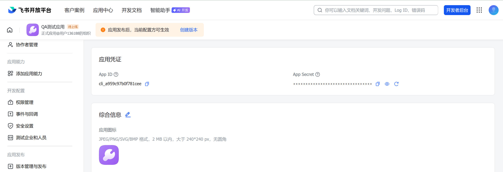
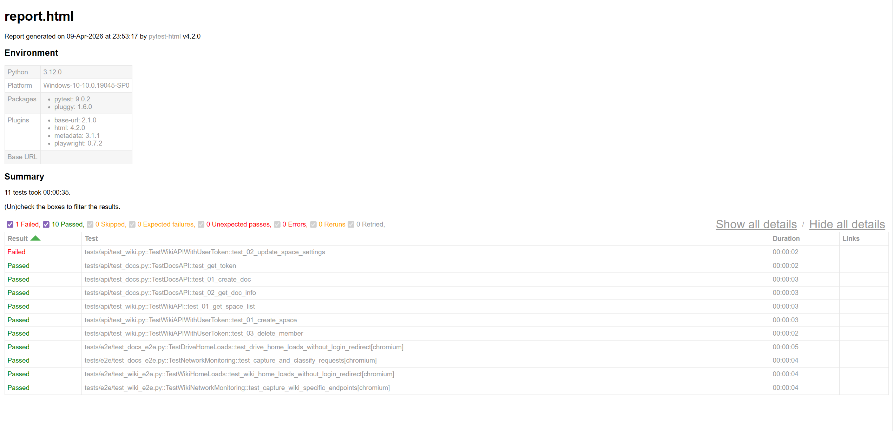
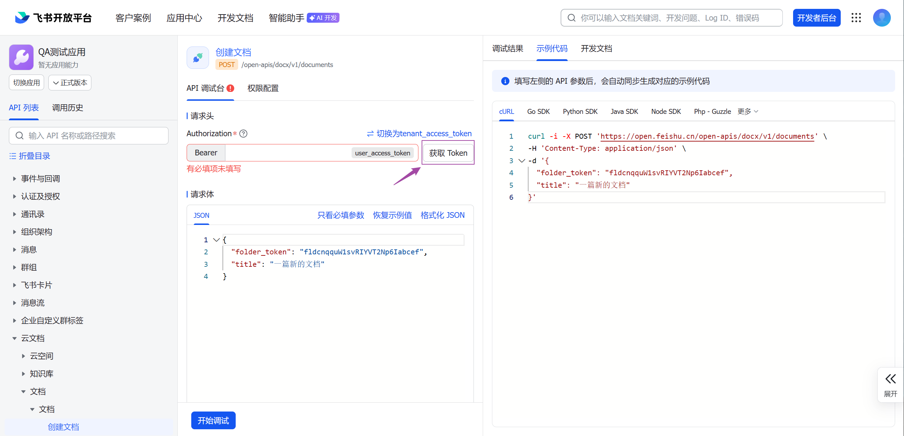

# 飞书开放平台 API 测试项目

本项目用于实操飞书开放平台服务端 API 测试，涵盖以下测试方式：

- **HTTPS 各种方法请求**
- **Playwright 端到端 (E2E) 测试**（预留）
- **Python requests 库 + pytest 实现多参数自动化接口/集成测试**
- **生成 HTML 测试报告**

层级简介：
- 配置层：管理 `APP_ID`、`APP_SECRET`、`BASE_URL`
- API 封装层：把飞书接口包装成 Python 方法
- Token 管理层：自动获取、缓存、刷新 `tenant_access_token`
- API 自动化测试层：基于 `pytest + requests`
- E2E 测试层：基于 `Playwright + pytest-playwright`
- 报告输出层：基于 `pytest-html` 生成 HTML 报告

> 📖 开放平台 API 文档首页：https://open.feishu.cn/document/home/index


## 功能覆盖

### API 测试

目前已覆盖：

- 云文档
  - 创建文档
  - 获取文档基本信息
- 知识库
  - 获取知识空间列表
  - 创建知识空间
  - 更新知识空间设置
  - 删除知识空间成员

### E2E 测试

目前已覆盖：

- 云文档首页 登录态校验
- Wiki 首页登录态校验
- 页面加载时网络请求监听与分类统计


## 项目结构

```text
feishu-api-test/
├── .gitignore                  # Git 忽略规则
├── LICENSE
├── README.md
├── requirements.txt
├── conftest.py
│
├── config/				 # 配置文件
│   ├── __init__.py
│   ├── settings.py              # 本地真实配置，不提交到 Git（app_id、app_secret）
│   └── settings.py.template     # 配置模板
│
├── api/           			
│   ├── __init__.py
│   ├── base.py                  # 基础请求封装
│   ├── docs.py                  # 云文档 API 封装
│   └── wiki.py                  # 知识库 API 封装
│
├── utils/
│   ├── __init__.py
│   └── token_manager.py         # tenant_access_token 获取、缓存、刷新
│
├── tests/
│   ├── __init__.py
│   ├── api/
│   │   ├── __init__.py
│   │   ├── conftest.py          # API 测试专用 fixture
│   │   ├── test_docs.py         # 文档 API 测试
│   │   └── test_wiki.py         # 知识库 API 测试
│   └── e2e/
│       ├── __init__.py
│       ├── conftest.py          # E2E 测试专用 fixture
│       ├── save_auth.py         # 手动登录并保存 auth_state.json
│       ├── test_docs_e2e.py     # 云文档页面 E2E
│       └── test_wiki_e2e.py     # Wiki 页面 E2E
│
└── reports/
    ├── .gitkeep
    └── report.html              # 本地生成的 HTML 报告
```

## 运行环境

建议环境：

- Python 3.10+
- Windows PowerShell / macOS / Linux
- 一个你自己创建的飞书企业应用 （开发者后台注册） 

## 快速开始

### 1. 克隆仓库

```bash
git clone https://github.com/KunW777/feishu-api-test
cd feishu-api-test
```

### 2. 安装依赖

```bash
pip install -r requirements.txt
```

如果你要运行 E2E 测试，还需要安装 Playwright 浏览器：

```bash
python -m playwright install
```

## 第一步：配置 `APP_ID` 和 `APP_SECRET`

先从模板复制出真实配置文件。

Windows PowerShell：

```powershell
Copy-Item config\settings.py.template config\settings.py
```

macOS / Linux：

```bash
cp config/settings.py.template config/settings.py
```

然后编辑 `config/settings.py`：

```python
APP_ID = "cli_xxxxxxxxxxxxx"
APP_SECRET = "xxxxxxxxxxxxxxxx"

BASE_URL = "https://open.feishu.cn/open-apis"
TOKEN_EXPIRE_BUFFER = 300
```

### 去哪里拿 `App ID` 和 `App Secret`

路径如下：

1. 打开飞书开放平台 https://open.feishu.cn/
2. 登录账号并进入你的应用
3. 在应用后台进入「凭证与基础信息」
4. 复制页面中的 `App ID` 和 `App Secret`

对应页面示例：



注意：

- 当前项目的 `.gitignore` 已忽略 `config/settings.py`

## 第二步：先跑基础 API 测试

这一步不需要 `user_access_token`。
程序会使用 `APP_ID + APP_SECRET` 自动换取 `tenant_access_token`。

执行：

```bash
pytest tests/api -v -s --html=reports/report.html --self-contained-html
```

参数说明：

- `-v`：显示更详细的测试名
- `-s`：显示测试中的 `print` 输出
- `--html=reports/report.html`：生成测试报告
- `--self-contained-html`：把样式和资源内嵌到单个 HTML 文件中

如果一切正常，执行后你会得到：

- `reports/report.html`

报告效果示例：



## 第三步：获取 `user_access_token`

项目中有些接口需要“用户身份”而不是“应用身份”。
当前项目里最典型的是：

- 创建知识空间

这类接口需要通过飞书开放平台的 API 调试台获取 `user_access_token`。

操作步骤：

1. 打开飞书开放平台并进入你的应用
2. 打开「API 调试台」
3. 选择一个需要用户权限的接口
4. 在 `Authorization` 区域把鉴权方式切到 `user_access_token`
5. 点击「获取 Token」并完成授权
6. 复制返回的 `user_access_token`

操作位置示例：



这样可以获得两类 token：

- `tenant_access_token`：应用身份，适合服务端接口
- `user_access_token`：用户身份，适合必须代表某个用户执行的接口

注意：

- `user_access_token` 通常有时效
- 过期后需要重新获取


## 第四步：跑完整 API 测试

拿到 `user_access_token` 后，再执行完整接口测试。


```powershell
pytest tests/api -v -s --user-token "你的 user_access_token" --html=reports/report.html --self-contained-html
```

```bash
pytest tests/api -v -s --user-token "你的 user_access_token" --html=reports/report.html --self-contained-html
```

如果你不传 `--user-token`：

- 需要用户权限的测试会被 `skip`
- 基础 API 测试仍然可以继续运行

## 第五步：运行 E2E 测试

E2E 测试不依赖开放平台服务端 token，而是复用你自己的飞书登录态。

第一次运行前，先保存登录态：

```bash
python tests/e2e/save_auth.py
```

脚本会做三件事：

1. 自动打开 Chromium 浏览器
2. 等你手动登录飞书
3. 在你回到终端按 Enter 后，把登录态保存为 `tests/e2e/auth_state.json`

然后执行 E2E 测试：

```bash
pytest tests/e2e -v -s
```

如果你也想生成报告：

```bash
pytest tests/e2e -v -s --html=reports/report.html --self-contained-html
```

E2E 依赖说明：

- `tests/e2e/auth_state.json` 由 `python tests/e2e/save_auth.py` 生成
- 这个文件已被 `.gitignore` 忽略
- 每个开发者都需要在自己本地生成一次

## 推荐执行顺序

如果你是第一次接触这个项目，建议按这个顺序来：

1. 配置 `APP_ID` 和 `APP_SECRET`
2. 跑 `tests/api/test_docs.py`
3. 跑 `tests/api/test_wiki.py`
4. 获取 `user_access_token`
5. 再跑完整 `tests/api`
6. 最后跑 `tests/e2e`


跑 API 测试：

```bash
pytest tests/api -v -s --user-token "你的 user_access_token" --html=reports/report.html --self-contained-html
```

跑 E2E 测试：

```bash
python tests/e2e/save_auth.py
pytest tests/e2e -v -s --html=reports/report.html --self-contained-html
```
一行命令跑所有测试：

```bash
pytest tests -v -s --user-token "你的 user_access_token" --html=reports/report.html --self-contained-html
```


## Token 使用说明

当前项目中的接口和 token 对应关系如下：

| 接口 | Token 类型 |
|------|------------|
| 创建文档 | `tenant_access_token` |
| 获取文档信息 | `tenant_access_token` |
| 获取知识空间列表 | `tenant_access_token` |
| 创建知识空间 | `user_access_token` |
| 更新知识空间设置 | 依赖已创建空间，当前测试流程中与上一步联动 |
| 删除知识空间成员 | 依赖已创建空间，当前测试流程中与上一步联动 |

